# 考试工具包examate使用演示

下面用2018年度*Mathematical Physics*科的真题，一步步演示如何利用我写的`examate`工具包辅助考试。

<br>

## 准备工作

### 1.配置环境

要使用工具包，需要有Mathematica内核环境。要实现这一点有以下几种选择：

* 免费、少量折腾：下载安装[Wolfram Engine](https://www.wolfram.com/engine/)；
* 免费、最折腾：[下载Mathematica 12](https://tiebamma.github.io/InstallTutorial/)，并用keygen破解之；
* 付费、不折腾：[购买正版Mathematica 12](https://www.wolfram.com/mathematica/?source=nav)。

需要注意的是，只有选择安装整个Mathematica（方案2或3），才能使用交互式notebook；而如果选用方案1安装Wolfram Engine，则只能修改文本文件后静态执行。具体解释请参见本文附录。

<br>

### 2.导入工具包

工具包已经在[Github](https://github.com/Deleeete/examate)上开源。下载包文件`examate.wl`即可。

（下载地址：[直链](https://raw.githubusercontent.com/Deleeete/examate/main/examate.wl)）

下载完成后，可以通过执行以下指令导入程序包：
```mathematica
<< "path\\to\\examate.wl"

(*字符串里写程序包的绝对路径*)
```

至此准备工作完成。

<br>

## 考试使用示范

### A1

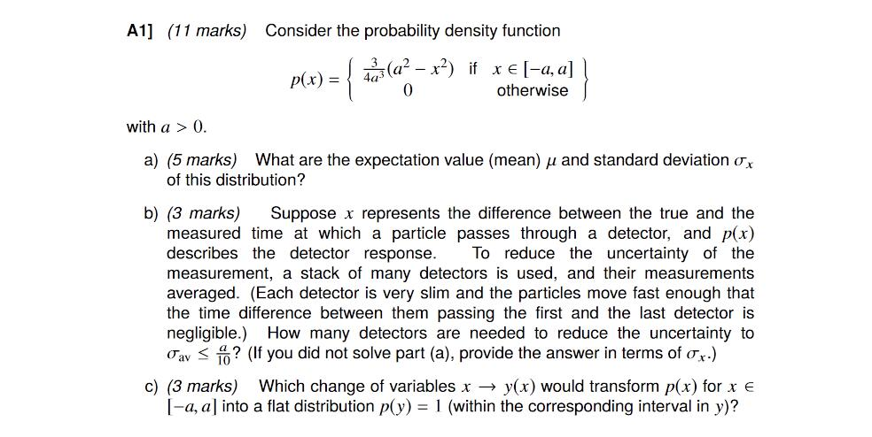

<br>

### a) 已知PDF函数，算均值和标准差

这一问很弱智。`examate`里提供了一系列以**PDF**开头的函数，来计算这样已知PDF，求均值（期望）/方差/标准差的题型。在notebook中输入“PDF”后，在自动补全的列表里就可以看到这些函数的身影。其中以“(Examate`)”结尾的函数都是程序包内定义的：

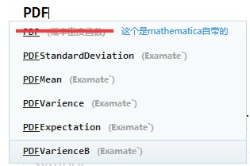

不难发现，计算均值的函数叫作`PDFMean`。如果你不确定该输入哪些参数，可以通过执行`?PDFMean`来查看帮助信息：

（Notebook输出）
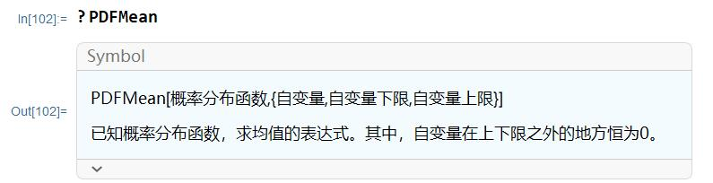

（Wolfram Engine输出）
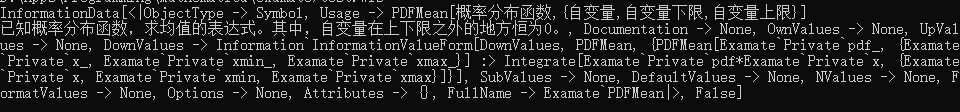

计算标准差的函数`PDFStandardDeviation`同理。

根据帮助，我们可以写下以下代码：

```mathematica
PDFMean[3/(4*a^3) (a^2 - x^2), {x, -a, a}]

PDFStandardDeviation[3/(4*a^3) (a^2 - x^2), {x, -a, a}]

(*Notebook版本。输入后`Shift+Enter`运行*)
```

可以立刻得到如下输出：
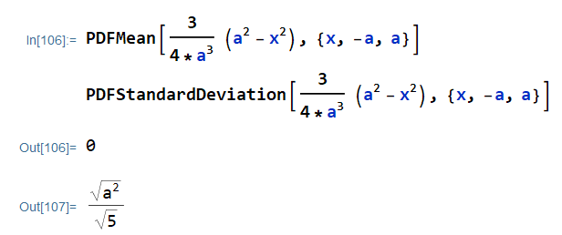

对于Wolfram Engine用户，则需要在wls文件中写下

```mathematica
<< "path\\to\\examate.wl"

result1 = PDFMean[3*(a^2 - x^2)/(4*a^3), {x, -a, a}]

result2 = PDFStandardDeviation[3*(a^2 - x^2)/(4*a^3), {x, -a, a}]

Print[result1]
Print[result2]

(*Wolfram Engine版本，输入后在命令提示符运行*)
```
然后在cmd中运行命令
```bat
//假设wls文件的名字为test.wls，下同

D:\path\to\wls> test.wls   //输入后回车
0
Sqrt[a^2]/Sqrt[5]    //程序会回显这两行输出

D:\path\to\wls> _
```

注意题目有额外说明a>0，所以`Sqrt(a^2)/Sqrt(5)`等价于a/Sqrt(5)，这也就是我们想要的答案。

故均值表达式为0（偶PDF的必然结果），标准差的表达式为a/Sqrt(5)。

<br>

### b) 已知总体标准差和目标的样本标准差，求需要重复实验的最小次数

这种题只是一元二次方程/不等式，连求导/积分都没涉及，所以我没有写相关函数（其实手算完全有可能更快）。

总体标准差`sigma`、样本标准差`sigma_a`和重复实验次数`n`满足关系

<center>sigma_a == sigma/Sqrt(n)</center>

<br>

所以一定要用Mathematica的话，用 `Solve`函数解方程即可：

```mathematica
(*之前已经算得标准差为a/Sqrt[5]*)

Solve[a/Sqrt[5]/Sqrt[n] == a/10, n]

(*解关于n的方程 *)
```

输出结果：

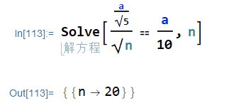

因此这题的答案为20。

<br>

### c) PDF自变量转换

题目考察随机变量的PDF与其函数的PDF之间的关系。`examate`提供了`PDFVariableTransform`函数进行相关运算。

但是要注意这题是反过来的。函数的功能是已知f(x)=y求p(y)，题目却反其道而行之，已知p(y)，要求y的表达式。`examate`给这种情形写了一个变种函数——`PDFVariableTransformSolve`：

```mathematica
px = 3*(a^2 - x^2)/(4*a^3) (*自变量的PDF p(x)*)
py = 1   (*y=f(x)的PDF py(y) = p(f(x))*)

PDFVariableTransformSolve[px, x, py]

(*Wolfram Engine需要在前面加Pring@才能看到结果，下同*)
```

可以直接得到结果：

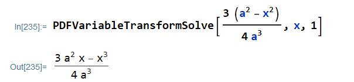
（Notebook输出）

或者

```bat
D:\path\to\wls> test.wls
(3*a^2*x - x^3)/(4*a^3)

```
（Wolfram Engine输出）

**注意，你显然还是需要知道之前这两题怎么写，才能在试卷上写出过程。这个程序包只是把求导/微分/解方程等基础过程自动化以规避低级错误。**

**只有一个答案是拿不了分的（也不应该拿分）。下面大部分题也都是这样。**

到这里第一大题就结束了。由于是刚开始所以说得比较详细，速度比较慢，接下来会加快。

<br>

### A2

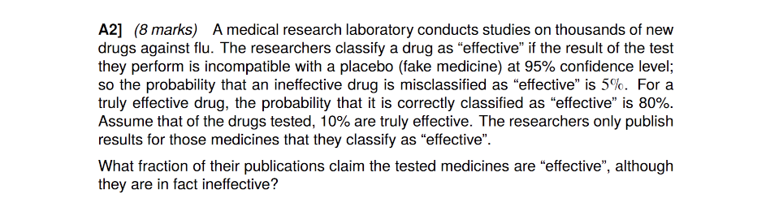

这种真假阴阳问题参数比较多，相应的潜在问法也非常多。所以`examate`没有直接封装整个函数，只是针对性地导入了几个常用公式：

* 条件概率公式：`PAgivenB`
* 逻辑或概率公式：`PAorB`
* 贝叶斯公式：`PAgivenBBayes`
* 阳性预测值（已知检测阳性，实际确实为阳性的概率）：`PPV`
* 阴性预测值（已知检测阴性，实际确实为阴性的概率）：`NPV`

计算这类题的时候可以根据情况应用不同的公式。

这一题中，需要求的相当于“已知检测阳性，但实际阴性概率”。可以设如下事件：

* A：该药实际无效
* B：该药检测为有效

则我们的目标可以记作`P(A|B)`。若直接应用贝叶斯公式则有：

```mathematica
(*题目条件*)
pEffective = 0.1;       (*总体有效概率*)
sensitivity = 0.8;     (*测试的灵敏度，即P(测试有效|有效)*)
fpr = 0.05;            (*测试的假阳性率，即P(测试有效|无效)*)

(*参数的计算*)

pA = 1-pEffective;
pB1 = pEffective*sensitivity;   
pB2 = (1-pEffective)*fpr;
pB = pB1 + pB2;      
(*总体阳性概率 = 总体中有效部分的阳性率pB1+总体中无效部分的阳性率pB2*)
pBgivenA = fpr;     (*5%的假阳性率*)

PAgivenBBayes[pA, pB, pBgivenA]
```

可以得到答案为0.36。

另一方面，如果你了解诊断问题中PPV和NPV的概念，也可以用`examate`中的`PPV`函数来直接得到这题的答案。由于这题要求的情况是“已知阳性，实际阴性”，所以相当于1减去该测试的PPV值：

```mathematica
pEffective = 0.1;       (*总体有效概率*)
sensitivity = 0.8;     (*测试的灵敏度，即P(测试有效|有效)*)
fpr = 0.05;            (*测试的假阳性率，即P(测试有效|无效)*)

1 - PPV[pEffective, sensitivity, fpr]
```

结果同样是0.36。

当然，即使使用方法二，贝叶斯公式在过程里仍然要写出来（或者像3b1b一样用比例来写这题，更不容易出错）。

<br>

~~越来越感觉其实是在讲题而不是程序使用教程~~

### A3

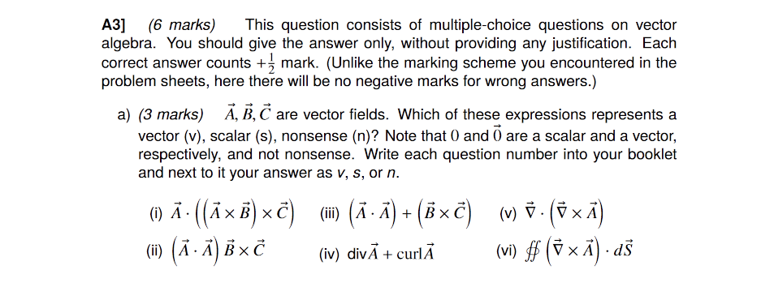
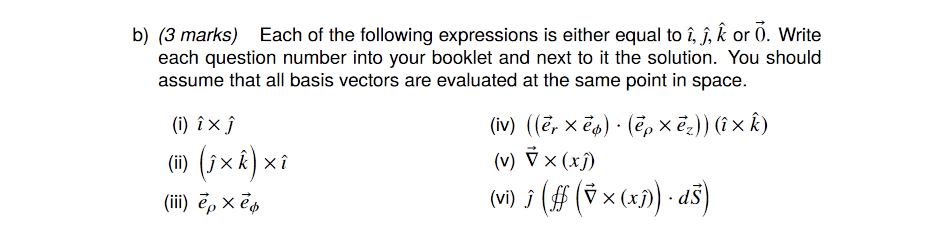

这题其实是考向量运算的理解，mathematica帮助很小。

当然，如果非要用也是可以的——只要把表达式放进去算就好了，如果结果是向量，返回的应该是形如`{a,b,c}`的列表形式；如果返回的是标量，返回结果应该是多项式；而如果运算没有意义，mathematica应该会报错。

但是这实际上比你想的要更麻烦——请注意，mathematica为了方便会自动对数组进行`Map`运算。

举个例子，标量与向量相加在数学上是没有意义的，所以这恰恰是题目说的nonsense情况（例如选项(iii)）。但在mathematica中，自动映射机制会导致标量`a`加上向量`v={vx,vy,vz}`并不会报错，而是返回向量`{vx+a,vy+a,vz+a}`。

不过这和`examate`程序包就没什么联系了，所以在这里不再细说。

<br>

### A4

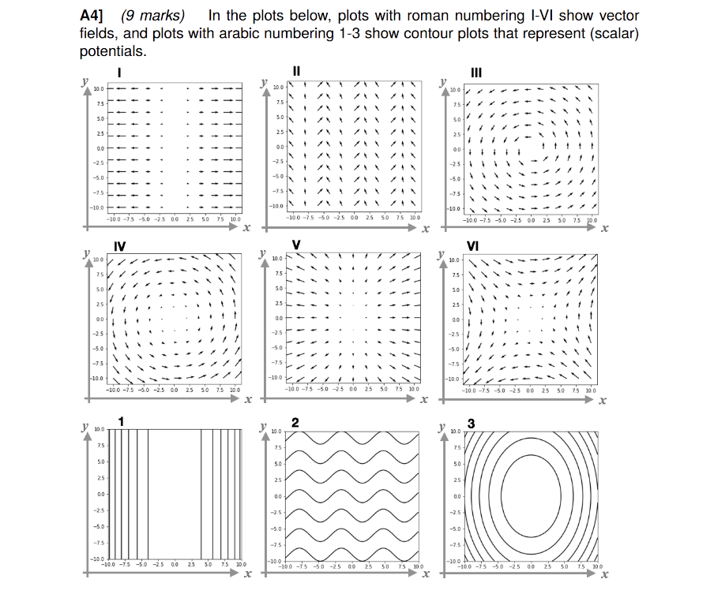
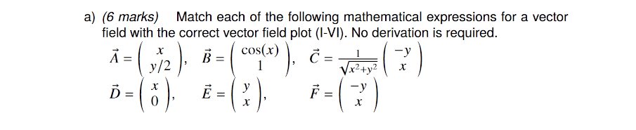
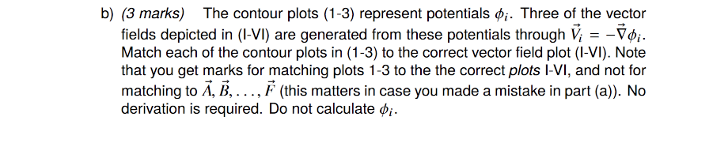

这题本身光看就能写出来了。如果一定要用mathematica辅助（作弊），可以使用原生函数`VectorPlot`。例如考虑**a)**的第一个向量场，可以写如下函数：

```mathematica
VectorPlot[{x, y/2}, {x, -10, 20}, {y, -10, 20}]
```

可以得到输出结果：
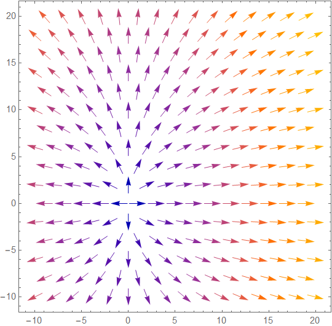

所以可以知道这个函数对应原题中的向量图V。其它表达式同理。

至于 **b)** 小问里的等高线，即使 **a)** 问用了mathematica来辅助，到了这一问也不至于要用了吧……多作一点法线就能看出来的程度。

<br>

### A5

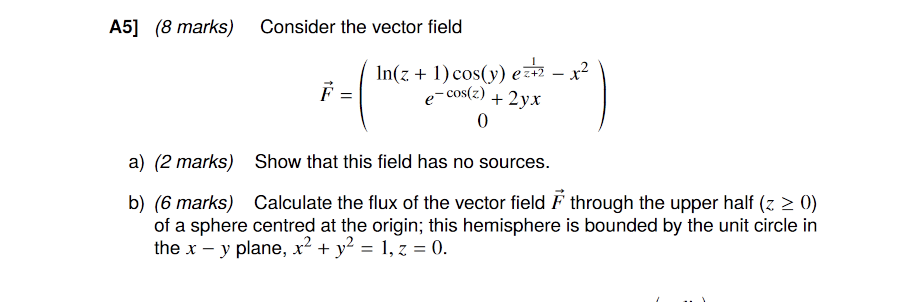

**a)** 直接计算其散度即可。对应的mathematica原生函数为`Div`，可以用来检查（这题要求是证明，所以实际上没啥好检查的，必然算得0）：

```mathematica
(*单独定义三个分量，不然看着会很乱*)
fx = Log[z + 16] Cos[y] E^(1/(z + 2)) - x^2;
fy = E^-Cos[z] + 2 y x;
fz = 0;

f = {fx, fy, fz}; (*定义向量场f(fx,fy,fz)*)

Div[f, {x, y, z}]
```

结果当然是0：

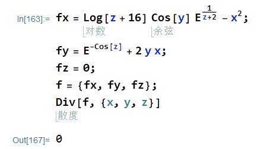

用内置的`Div`确实方便，但只能显示最终结果。中间过程要写到试卷上，仍然必须手动求每一个分量的偏导数。尽管这可以通过在mathematica中手动调用三次`D`函数来完成，这还是和`examate`的 **“自动化所有基础计算”** 以及 **“避免低级错误”** 的初衷不符。

而如果不用mathematica，纯粹手算则更加悲惨，万一dfx/dx、dfy/dy、dfz/dz之中某个求错了，发现加起来不是0还得反过来查错。这在已经知道计算方法的情况下对时间是一种纯粹的浪费。

因此，`examate`特别准备了另一个函数`DivProcess`，调用它可以看到散度计算过程中的中间结果。这个函数使用方法和内置的`Div`函数完全相同：

```mathematica
(*单独定义三个分量，不然看着会很乱*)
fx = Log[z + 16] Cos[y] E^(1/(z + 2)) - x^2;
fy = E^-Cos[z] + 2 y x;
fz = 0;

f = {fx, fy, fz}; (*定义向量场f(fx,fy,fz)*)

DivProcess[f, {x, y, z}]
```

输出结果中会依次打印各个分量的导数计算结果：
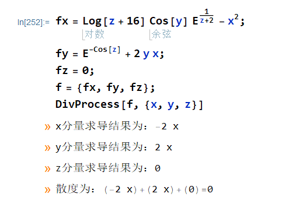

在Wolfram Engine环境下同样可以看到输出：
```batch
D:\path\to\wls> test.wls
>> x分量求导结果为：-2 x
>> y分量求导结果为：2 x
>> z分量求导结果为：0
>> 散度为：(-2 x)+(2 x)+(0)= 0
```

下一问要求通量，用斯托克斯定理解决。Mathematica帮不上忙。

<br>

### A6

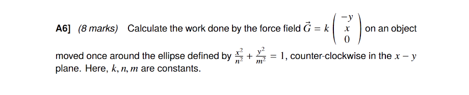

这是一道线积分基础题。通常这种题只考做法，所以积分本身不会做得很难（一般是可以心算的程度），完全可以手动做。

另一方面，mathematica中没有普适的、将笛卡尔方程转为参数方程的方法。所以`examate`程序包不计划将线积分功能整个实现出来。

<br>

### B7

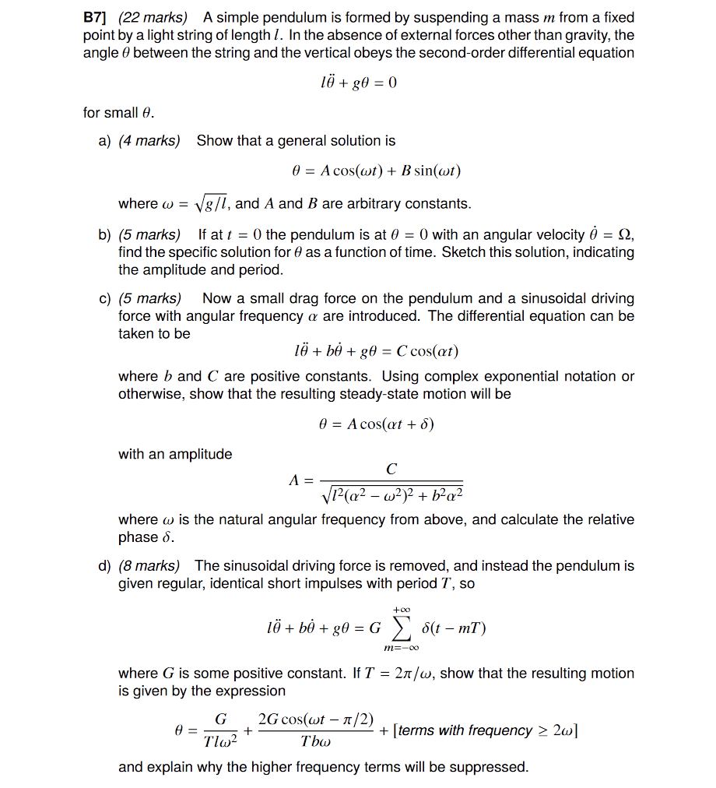

### a)

这种题这边建议直接待定系数。没必要真的解，结果是一样的。

```mathematica
theta = A Cos[omega t] + B Sin[omega t];

D[theta, {t,2}]   (*计算theta对t的二阶导数*)
```

可以得到结果：

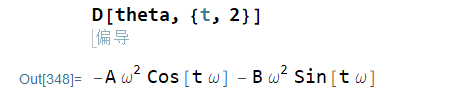

接下来就可以代入原式解关于`omega`的方程。方便起见第一步计算时就直接给导数起个名：

```mathematica
theta = A Cos[omega t] + B Sin[omega t];

d2theta = D[theta, {t,2}];   (*计算theta对t的二阶导数*)

Solve[l*d2theta+g*theta==0, omega]
```

可以得到结果：

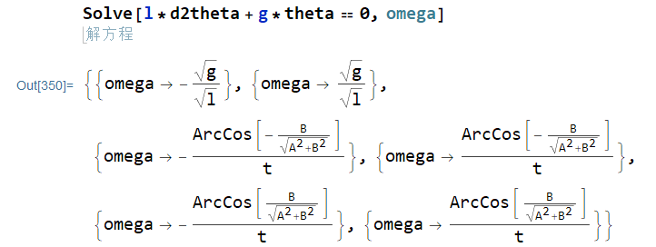

注意`l`和`g`均大于0，而底下四个解均与自变量`t`有关所以不是有效的解。因此，真正的解就是第二个解`omega == Sqrt(g/l)`。当然，用mathematica对这个过程没有任何帮助，甚至连检查效果都没有，因为解其实已经知道了。这种 *Show that...* 的题目本身就是侧重考方法，实际上解的过程直接用`=>`意思意思即可。

<br>

### b) 

初始条件无限代入求常数即可。

### c)


机智的我已经提前考虑到这个问题，并且把它写好了。比较合适的思路是把自变量向量化，然后做一点*微小*的调整，以及增加了中间变量（以保证代码组织有序）。这个函数是这样实现的：

```mathematica
randomWalk[startPosition_, n_, dist_] := Block[{xs, rv, mv},
  xs = {startPosition};
  Do[
   rv = RandomVariate[dist, startPosition // Length];
   mv = If[# > 0.5, 1, -1] & /@ rv;
   xs = Append[xs, Last@xs + mv]
   , n]; xs]
```
<br>

它可以生成**任意维度**下的随机游走序列。比如，画二维随机游走仍然只需要一行：

```mathematica
ListLinePlot[randomWalk[{0, 0}, 3000, dist], AspectRatio -> 1]

(*长度为3000次*)
(*自变量{0,0}自动决定了输出结果为二维*)
```

<br>

输出结果：


而多条轨迹画在一张图仍然可以用`Table`快速解决：

```mathematica
ListLinePlot[Table[randomWalk[{0, 0}, 3000, dist], 4], AspectRatio -> 1]

(*一次画四条轨迹*)
(*即使是i7-9750H，这东西也得跑大概10秒才能出结果*)
```

<br>

输出结果：


既然是任意维，不妨再试一下三维的情况。三维情况下画图的函数需要稍微改动一下。我研究了一下Mathematica的文档，综合来看有两种选择，一是`ListPlot3D`，画出来的是实体图形；二是使用`Graphics3D`，这样可以画出三维空间中的线。

首先尝试第一种：

```mathematica
ListPlot3D[Table[randomWalk[{0, 0, 0}, 3000, dist], 2], AspectRatio -> 1]

(*ListPlot3D[]画出来的是三维空间中的面*)
```

<br>

输出结果：


这个做法弄出来显然不是很好看，而且这些点集是有序的，本质上就不是平面，用这种方式画出来有违初衷。所以，不妨试一下`Line`的方法。

这一回很遗憾，不能再优雅地一行解决了——因为`Graphics`以及`Graphics3D`函数和`Plot`系函数不同，没有自动调整颜色的功能，所以需要手动定义。

<small>（当然，你实在想一行写完，把`style`代进第二行也不是不行，只不过大家看完代码会默默在心里骂你傻逼而已👍）</small>

```mathematica
style = {Pink, Blue, Orange};
(*定义颜色列表*)

Graphics3D[
 Table[List[style[[i]], Line[randomWalk[{0, 0, 0}, 3000, dist]]], {i, 1, 
   3}], AspectRatio -> 1]
```

<br>

输出结果：


<br>

投影看不出三维结构，所以再来个动画版：


<br>

还能说啥呢？Mathematica牛逼就完事了。


<br>

## 彩蛋

在研究怎么输出3D视角动图的时候，我找到了Stack Exchange的一个[相关问题](https://mathematica.stackexchange.com/questions/4537/rotating-3dplot-into-animated-gif)。这个问题只有一个回答（但是确实完美提供了解决问题的必要信息），回答本身和评论都把我给看乐了。由于回答是动图，所以我就不放在这里了。各位可以跟随链接自行围观。

另外附上生成动图的完整代码。为了让视角运动平滑并且轨迹合适，我还是研究了好一会的，尤其是要设计并调整`ViewVector`的参数方程：

```mathematica
style = {Pink, Green, Orange};

lines = Table[
   List[style[[i]], Line[randomWalk[{0, 0, 0}, 3000, dist]]], {i, 1, 3}];

td = Table[
   Graphics3D[lines, AspectRatio -> 1, SphericalRegion -> True, 
    ViewVector -> { 80 Sin[t], 80 Cos[t], 0}], {t, 0, 2 Pi, Pi/30}];

Export["animated.gif", td, "DisplayDurations" -> 0.04, "AnimationRepetitions" -> \[Infinity]]
```


<br><br><br><br><br>
<hr>